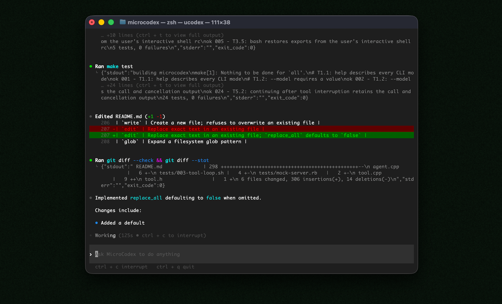

<p align="center"><strong>MicroCodex</strong> is an ultra-lightweight coding agent that runs locally in your terminal.
<p align="center">
  
</p>
</br>
MicroCodex is written in C++23 and provides one-shot prompts, an interactive terminal UI, local coding tools, durable conversations, and automatic context compaction.
</p>

---

## Quickstart

### Installing and running MicroCodex

Run the following on Mac or Linux to install MicroCodex:

```shell
curl -fsSL https://github.com/paoloanzn/microcodex/releases/latest/download/install.sh | sh
```

Then simply run `microcodex login` to sign in, followed by `microcodex` to get started.

<details>
<summary>You can also go to the <a href="https://github.com/paoloanzn/microcodex/releases/latest">latest GitHub Release</a> and download the appropriate binary for your platform.</summary>

Each GitHub Release contains these executables:

- macOS
  - Apple Silicon/arm64: `microcodex-aarch64-apple-darwin.tar.gz`
  - x86_64: `microcodex-x86_64-apple-darwin.tar.gz`
- Linux
  - x86_64: `microcodex-x86_64-unknown-linux-gnu.tar.gz`
  - arm64: `microcodex-aarch64-unknown-linux-gnu.tar.gz`

Each archive contains a single entry with the platform baked into the name (for example, `microcodex-aarch64-apple-darwin`), so you likely want to rename it to `microcodex` after extracting it.

</details>

The installer selects the native build for the current architecture. Linux requires the libcurl and OpenSSL runtime libraries.

To install a specific release, set `MICROCODEX_RELEASE`:

```shell
curl -fsSL https://github.com/paoloanzn/microcodex/releases/latest/download/install.sh | MICROCODEX_RELEASE=v0.1.0 sh
```

### Using MicroCodex with your ChatGPT plan

Run `microcodex login` and open the displayed URL in your browser. MicroCodex stores the resulting OAuth credentials under `$CODEX_HOME`, or `~/.codex` when `CODEX_HOME` is unset.

You can then start an interactive session or pass a one-shot prompt:

```shell
microcodex
microcodex "Find the failing test, fix it, and run the relevant test suite"
```

> [!WARNING]
> MicroCodex is not a sandbox. Model-requested commands and file operations run with the same permissions as the MicroCodex process.

### Building from source

Building requires a C++23 compiler, `make`, libcurl development files, and OpenSSL development files on Linux.

```shell
git clone --recurse-submodules https://github.com/paoloanzn/microcodex.git
cd microcodex
make
```

The executable is written to `build/microcodex`. Run the test suite with `make test`.

## Known bugs and issues

- Text cannot currently be copied from the terminal while using MicroCodex.
- Dangerous shell commands are not yet gated by a safe-command policy.

## Docs

- [**CLI usage**](#using-microcodex-with-your-chatgpt-plan)
- [**Installing & building**](#installing-and-running-microcodex)
- [**Tests**](tests/TESTS.md)

This repository is licensed under the [Apache-2.0 License](LICENSE).
